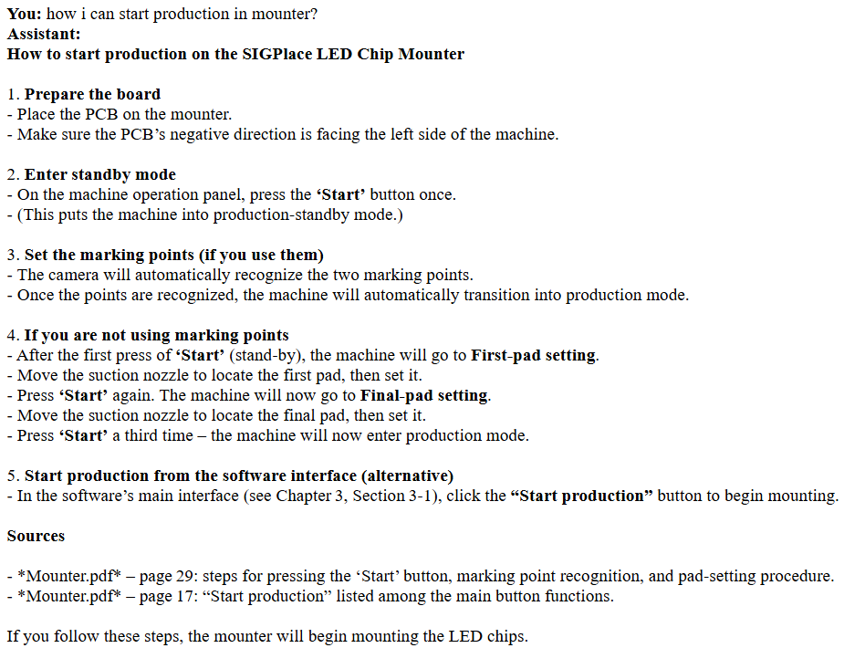
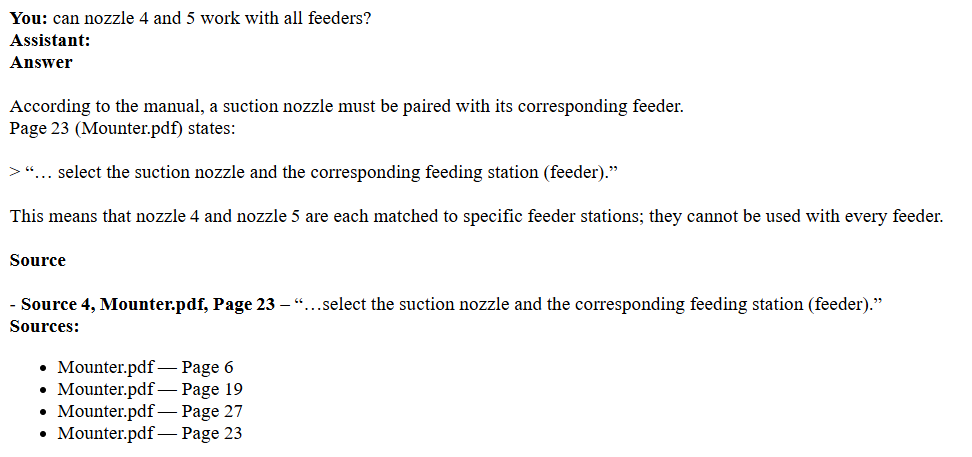

# Machine Manual Assistant

A RAG (retrieval-augmented generation) chatbot that answers questions about machine manuals and cites the manual and page behind every answer.

Ask a question in plain language, for example *"How do I reset the controller after an alarm?"*, and get a grounded answer with sources. If the manuals don't contain the answer, the assistant says so instead of guessing.

## Demo

Real answers from a public machine manual (`Mounter.pdf`), with the manual and page behind each answer.

**Procedure question:** step-by-step answer with page references



**Specific question:** answer grounded in a quoted excerpt, with a sources list



## How it works

```
PDF manuals ──► page-level text extraction (PyMuPDF)
            ──► overlapping chunks (1000 chars, 200 overlap)
            ──► embeddings (all-MiniLM-L6-v2)
            ──► ChromaDB (persistent vector store)

Question ──► embed ──► top-5 similar chunks ──► distance threshold filter
         ──► LLM answers using ONLY those excerpts ──► answer + manual/page sources
```

- **Grounded answers:** the prompt restricts the model to the retrieved excerpts and requires a fixed "could not find" reply when the answer isn't there.
- **Refusal on weak matches:** chunks beyond a distance threshold are discarded; if nothing remains, no LLM call is made.
- **Citations:** each chunk keeps its manual name and page number through ingestion and retrieval.
- **Casual chat handling:** greetings and small talk are answered without retrieval or sources.

## Tech stack

| Part | Tool |
|---|---|
| PDF parsing | PyMuPDF |
| Embeddings | sentence-transformers (`all-MiniLM-L6-v2`) |
| Vector store | ChromaDB (persistent) |
| LLM | Any OpenAI-compatible provider (Ollama, Gemini, OpenAI, Groq, ...) |
| Backend | FastAPI + Uvicorn |
| Frontend | Plain HTML + JavaScript |

## Project structure

```
.
├── main2.py          # FastAPI app (serves the UI and the /ask endpoint)
├── rag2.py           # retrieval + answer generation
├── ingest.py         # builds the vector database from PDFs
├── index.html        # chat page
├── script.js         # chat logic
├── manuals/          # put your PDF manuals here (not committed)
├── docs/             # screenshots used in this README
├── .env.example      # LLM provider settings template
├── Dockerfile
├── .dockerignore
├── requirements.txt
└── README.md
```

## Setup

### 1. Install

```bash
git clone <your-repo-url>
cd <repo-folder>
pip install -r requirements.txt
```

### 2. Add manuals

Put one or more PDF manuals in the `manuals/` folder (create it if needed), and make sure `MANUALS_FOLDER` in `ingest.py` points to it:

```python
MANUALS_FOLDER = Path("manuals")
```

> PDFs and the generated `chroma_db/` folder are git-ignored on purpose. Don't commit manuals you don't have the right to share.

### 3. Build the vector database

```bash
python ingest.py
```

Run this once, and again whenever the manuals change. It creates a `chroma_db/` folder.

### 4. Choose an LLM (required)

The assistant needs an LLM to write answers. It works with **any OpenAI-compatible provider**: Ollama (local, free), Google Gemini, OpenAI, Groq, OpenRouter and others. You choose by setting three values.

1. Copy `.env.example` to `.env`.
2. Keep one provider block and fill in your key:

| Provider | `LLM_BASE_URL` | `LLM_API_KEY` | `LLM_MODEL` |
|---|---|---|---|
| Ollama (local, no key) | `http://localhost:11434/v1` | `ollama` (any text) | e.g. `llama3.1:8b` |
| Google Gemini (free tier) | `https://generativelanguage.googleapis.com/v1beta/openai/` | your Gemini key | e.g. `gemini-2.5-flash` |
| OpenAI (paid) | `https://api.openai.com/v1` | your OpenAI key | an OpenAI model name |
| Groq (free tier) | `https://api.groq.com/openai/v1` | your Groq key | a model from Groq's docs |

Model names change often, so copy the current one from the provider's documentation.

If you set nothing, the app defaults to a local Ollama server (`ollama pull llama3.1:8b` first, no key needed).

You can also set the variables in the terminal instead of using `.env`:

```bash
# Windows CMD
set LLM_BASE_URL=https://generativelanguage.googleapis.com/v1beta/openai/
set LLM_API_KEY=your-key
set LLM_MODEL=gemini-2.5-flash
```

Never commit your key. `.env` is already in `.gitignore`.

> Free tiers may use your data to improve the provider's products and have low rate limits. Don't send confidential manuals through them. Use a local model (Ollama) for private documents.

### 5. Run

```bash
uvicorn main2:app --reload
```

Open http://127.0.0.1:8000 and start asking questions.

## Run with Docker (optional)

Requires Docker Desktop. Put your PDFs in `manuals/` and create your `.env` first (see step 4). The `.env` file is passed in at run time and is never copied into the image.

```bash
# 1. Build the image
docker build -t manual-assistant .

# 2. Build the vector database (once, and whenever the manuals change)
docker run --rm --env-file .env -v "%cd%/manuals:/app/manuals" -v "%cd%/chroma_db:/app/chroma_db" manual-assistant python ingest.py

# 3. Start the server
docker run -p 8000:8000 --env-file .env -v "%cd%/chroma_db:/app/chroma_db" manual-assistant
```

Then open http://127.0.0.1:8000.

- The commands above are for Windows CMD. In PowerShell replace `%cd%` with `${PWD}`, and on macOS/Linux with `$(pwd)`.
- Inside a container `localhost` is the container itself. If you use Ollama on your own machine, set `LLM_BASE_URL=http://host.docker.internal:11434/v1`.
- The embedding model is downloaded on first start, so the container needs internet access.

## Configuration

Settings live at the top of `ingest.py` and `rag2.py`:

| Setting | Default | Meaning |
|---|---|---|
| `CHUNK_SIZE` / `CHUNK_OVERLAP` | 1000 / 200 | Chunking in characters |
| `EMBEDDING_MODEL` | `all-MiniLM-L6-v2` | Sentence-transformers model |
| `TOP_K` | 5 | Chunks retrieved per question |
| `DISTANCE_THRESHOLD` | 1.30 | Maximum distance for a chunk to count as relevant |
| `LLM_BASE_URL` / `LLM_API_KEY` / `LLM_MODEL` | Ollama defaults | LLM provider settings (see step 4) |

## API

`POST /ask`

```json
{ "question": "How do I replace the filter?" }
```

Response:

```json
{
  "answer": "1. Switch off the machine ...",
  "sources": [{ "manual": "machine_manual.pdf", "page": 42 }]
}
```

## Evaluation

<!-- TODO: fill in after running your test set. Delete this note when done. -->

| Metric | Result |
|---|---|
| Test questions | _N_ |
| Retrieval hit@5 (correct page in top 5) | _X %_ |
| Answers judged correct | _X %_ |

## Known limitations

- Text-only extraction: tables and scanned (image-only) pages are not handled well.
- Chunks do not cross page boundaries, so procedures spanning pages may be split.
- The embedding model is small and English-focused.
- No conversation memory: each question is answered independently.
- No authentication. Run it locally or behind your own access control.

## Roadmap

- [ ] Evaluation script with a question set and retrieval/answer metrics
- [ ] Hybrid search (BM25 + embeddings) and a reranker
- [ ] Table-aware extraction and OCR for scanned pages
- [ ] Multilingual embeddings
- [ ] Conversation history and streaming responses
- [ ] Docker setup

## License

MIT
